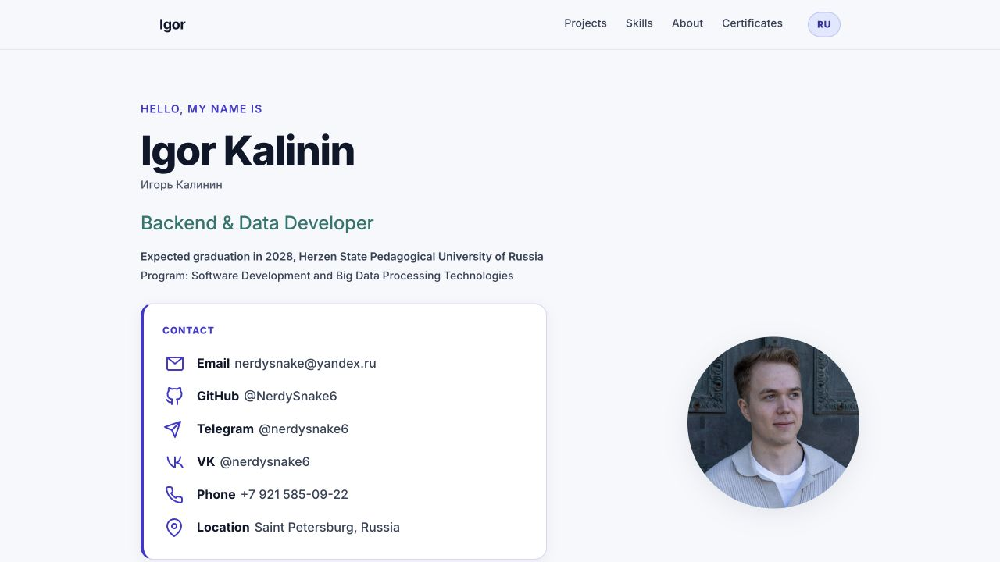

# Igor Kalinin / Игорь Калинин — Portfolio

Multilingual portfolio of Igor Kalinin, a Backend & Data Developer. Русская и
английская версии доступны по отдельным URL и полностью индексируются без
JavaScript.

Репозиторий содержит исходный код сайта, в котором собраны ключевые направления моей работы: backend-разработка, аналитика данных, прикладные проекты, достижения и сертификаты.

## Онлайн-версия

[nerdysnake6.github.io](https://nerdysnake6.github.io/)

Корневая страница предлагает выбрать язык. Русская версия доступна по адресу
[nerdysnake6.github.io/ru/](https://nerdysnake6.github.io/ru/), английская — по адресу
[nerdysnake6.github.io/en/](https://nerdysnake6.github.io/en/).



## Что представлено на сайте

- краткое профессиональное позиционирование
- навыки и инструменты для анализа данных
- достижения и учебно-практический опыт
- проекты с описанием задачи, стека и результата
- сертификаты
- контакты для связи

## Технологии

- HTML5
- CSS3
- JavaScript
- GitHub Pages
- GitHub Actions

## Структура проекта

```text
my-portfolio/
├── .github/
│   └── workflows/
│       ├── codeql.yml
│       └── pages.yml
├── assets/
│   ├── certificates/
│   ├── og/
│   │   ├── portfolio-preview-default.{svg,png}
│   │   ├── portfolio-preview-en.{svg,png}
│   │   └── portfolio-preview-ru.{svg,png}
│   ├── favicon.svg
│   ├── portfolio-screenshot-en.jpg
│   ├── photo-cropped-20260425.jpg
│   └── photo.jpg
├── docs/
│   └── README.md
├── scripts/
│   ├── site-config.mjs
│   ├── update-site-origin.mjs
│   └── validate-site.mjs
├── en/
│   └── index.html
├── ru/
│   └── index.html
├── index.html
├── robots.txt
├── sitemap.xml
├── style.css
├── app.js
└── README.md
```

- `index.html` - страница выбора языка
- `ru/index.html` - русская версия портфолио
- `en/index.html` - английская версия портфолио
- `style.css` - стили интерфейса
- `app.js` - progressive enhancement для меню, переключателя языка и сертификатов
- `assets/` - изображения профиля и сертификатов
- `assets/og/` - локализованные Open Graph-превью; SVG хранит редактируемый
  исходник, PNG используется социальными платформами
- `assets/portfolio-screenshot-en.jpg` - актуальный скриншот опубликованного сайта
- `robots.txt` и `sitemap.xml` - базовые инструкции для поисковых роботов
- `.github/workflows/pages.yml` - CI и деплой в GitHub Pages
- `scripts/site-config.mjs` - централизованный origin и публичные URL
- `scripts/update-site-origin.mjs` - синхронизация нового origin во всех SEO-файлах
- `scripts/validate-site.mjs` - проверка структуры сайта, SEO и локальных ресурсов

## SEO и локализация

- отдельные URL `/ru/` и `/en/`, а также корневая страница выбора языка
- `canonical` и взаимные `hreflang` для `ru`, `en` и `x-default`
- локализованные title, description и Open Graph-данные
- JSON-LD `ProfilePage` и `Person`
- `robots.txt`, `sitemap.xml` и файлы подтверждения Google и Яндекса
- централизованный origin в `scripts/site-config.mjs`

## Локальный запуск

```bash
python3 -m http.server 8000
```

После запуска сайт доступен по адресу `http://127.0.0.1:8000`.

## Проверка

```bash
node --check app.js
node --check scripts/site-config.mjs
node --check scripts/update-site-origin.mjs
node --check scripts/validate-site.mjs
node scripts/validate-site.mjs
```

## Контакты

- GitHub: [NerdySnake6](https://github.com/NerdySnake6)
- Email: [nerdysnake@yandex.ru](mailto:nerdysnake@yandex.ru)
- VK: [@nerdysnake6](https://vk.ru/nerdysnake6)
